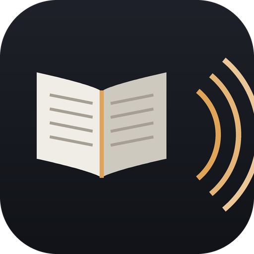

<div align="center">


# Herald

**Книги, прочитанные вслух — голосом, который выберешь сам**

Локальная озвучка книг на Mac (Apple Silicon). Без интернета, без подписок,
без отправки данных. Голос клонируется из любой записи нужного диктора.

</div>

---

## Возможности

- **Языки:** русский и английский. Язык книги определяется сам, под него берётся
  своя модель (для русского — с ударениями, для английского — без). Голоса
  помечены языком; для английской книги нужен образец англоязычного диктора.
  Язык образца определяется при его разборе автоматически.
- **Вход:** `.txt`, `.md`, `.docx`, `.epub`, `.fb2` (+`.fb2.zip`), `.pdf`
  (только текстовый слой; сканы пропускаются).
- **Главы:** из оглавления epub/fb2, стилей docx; иначе по «Глава N» или по размеру.
- **Ударения:** RUAccent ставит их автоматически на весь текст; движок их слушается
  (F5 и Silero — да; форматы «твáрей», «молокó»).
- **Голос:**
  - **F5** — клонирование по образцу: кладёшь короткий фрагмент речи диктора,
    приложение готовит его один раз и озвучивает книгу этим голосом;
  - **Silero** — готовые голоса (eugene, aidar, baya, kseniya, xenia), очень быстрый.
- **Движок по умолчанию — `f5mlx`** (MLX, нативно на Apple Silicon): тот же голос
  и те же ударения, что у torch-версии, но в 4 раза быстрее. См. «Скорость».
- **Пробник:** ~1 минута из середины главы — послушать голос до многочасовой начитки.
- **Выход:** аудиокнига `.m4b` (главы-закладки, обложка, метаданные) и/или `.mp3` по главам.
- **Окно:** перетаскивание книги, оценка «сколько глав / сколько звука / сколько
  ждать» ДО старта, кнопка «Стоп», главы появляются по порядку и слушаются на ходу.

---

## Установка (Mac, Apple Silicon)

Ставим в **отдельное окружение (venv)**, чтобы не трогать глобальный torch 2.14
(им пользуются Scribe и Anonymizer). Нужен Python 3.12 и Homebrew-ffmpeg.

```
brew install ffmpeg
cd "…/Текст в Аудио"
bash setup_mac.command
```

Скрипт создаёт `.venv`, ставит проверенную связку (torch 2.6 + torchaudio 2.6,
F5, RUAccent и т. д.) и убирает лишний torchcodec. Модели (F5 accent_tune ~1.3 ГБ,
Silero ~40 МБ, распознавание образца) скачиваются при первом запуске и кэшируются.

Дальше каждый запуск - из этой папки, с активированным окружением:
```
source .venv/bin/activate
```

---

## Как запускать

**Обычный способ — двойной щелчок по `Herald.app`** в Finder.
(Запасной вариант — `Запустить.command`.)
Откроется окно. (Если macOS не даёт запустить в первый раз: правый клик по
файлу → «Открыть» → «Открыть».)

В окне:
1. Перетащи книгу в верхнее поле (или нажми «…или выбрать файл»).
   Сразу покажет: сколько глав, сколько будет звука и сколько займёт расчёт.
2. Выбери голос. Если списка нет — «Добавить образец…» и укажи 10-60 секунд
   чистой речи нужного диктора (готовится один раз, дальше берётся из списка).
3. «🔊 Проверить голос» — минута из середины, чтобы не ждать часы зря.
4. «▶︎ Озвучить книгу». Главы появляются по порядку в папке рядом с книгой —
   их можно слушать, не дожидаясь конца. «■ Стоп» прерывает, готовое остаётся.

### Из командной строки

```
source .venv/bin/activate
python cli.py "<твоя книга>.fb2" --voice "голос диктора"
```

Пробник на минуту (и заодно подготовка голоса из образца):
```
python cli.py "<твоя книга>.fb2" --ref "<аудиокнига диктора>.mp3" --preview 1 --chapter 2
```

Флаги: `--engine f5mlx|f5|silero` (по умолчанию `f5mlx`), `--ref <образец>`,
`--voice <id>`, `--preview <мин>`, `--chapter <N>`, `--out <папка>`, `--m4b`,
`--no-mp3`, `--no-stress`, `--no-numbers`, `--nfe`, `--schedule epss|uniform`,
`--speed`.

---

## Как устроено

```
core/
  readers.py    форматы -> Document (текст, метаданные, обложка)
  normalize.py  подготовка текста (числа, сокращения, чистка)
  stress.py     ударения (RUAccent), формат '+' перед ударной гласной
  chapters.py   разбивка на главы
  engines/      сменные движки за единым интерфейсом
    base.py       интерфейс TTSEngine
    f5_mlx.py     F5-TTS на MLX — основной: клон голоса, быстрее реального времени
    f5.py         F5-TTS на torch (cpu/mps) — эталон для сверки, медленный
    apple.py      системный голос macOS — мгновенно, но готовый голос, не клон
    silero.py     Silero — быстрый запасной, голос роботный
  assemble.py   сборка .m4b и mp3 через ffmpeg
  pipeline.py   convert_book() (вся книга) и preview_sample() (пробник)
cli.py          запуск без интерфейса
tts_gui.py      окно (customtkinter + перетаскивание файлов)
Запустить.command  двойной щелчок в Finder -> окно
```

Папки в проекте:
```
<диктор> Артем - ...   аудиокнига-образец, из неё сделан голос
Сравнение скорости/      mp3 одного текста в разных режимах — выбрать на слух
Сравнение голоса/        старый и новый образец голоса — сравнить
Инструменты разработки/  bench.py, verify.py, compare_speed.py, _selftest.py
Архив/                   прошлые замеры и пробники, для работы не нужны
```

В окне намеренно мало настроек: `--device mps`, число процессов и темп речи
убраны, потому что первые два проверены как бесполезные на этой машине
(см. «Скорость»), а темп — часть уже одобренного звучания голоса. Из CLI они
никуда не делись.

---

## Скорость (замеры на Apple M4, 16 ГБ)

RTF = секунды расчёта на секунду звука. RTF 0,62 — «час звука за 37 минут».
Разборчивость — доля слов, которые распознаются обратно из синтеза
(`verify.py`), замер на целой главе (219 слов).

| Режим | RTF | Час звука за |
|---|---|---|
| **Обычное качество (по умолчанию)** | **0,78** | **47 мин** |
| Быстрее | 0,72 | 43 мин |
| Точнее, вдвое дольше | 1,70 | 102 мин |
| Системный голос macOS (не клон) | 0,05 | 3 мин |
| torch на CPU, как было в начале | 5,5 | 5,5 часа |

Разборчивость у всех режимов F5 в пределах 91–95% (доля слов, распознаваемых
обратно из синтеза). RTF стал чуть выше прежних 0,62 после того, как темп речи
вернули к 1.0: раньше речь была искусственно ускорена в 1,55 раза, и секунд
звука на тот же текст выходило меньше. Взамен голос звучит как оригинал.

Итог: **в 7 раз быстрее исходного CPU-варианта и быстрее реального времени**.
Книга `<твоя книга>.fb2` (8,3 часа звука) — около 6,5 часов вместо 46.
Системным голосом macOS — 24 минуты, но это не клон.

### Откуда взялось ускорение

1. **MLX вместо torch** (в 4 раза). Тот же чекпойнт, та же математика — выход
   DiT совпадает с torch с точностью float32. Подробности поломок, которые
   пришлось починить, — в шапке `core/engines/f5_mlx.py`.
2. **EPSS — прорежённое расписание шагов** (ещё вдвое). Из работы
   [Fast F5-TTS, arXiv 2505.19931](https://arxiv.org/abs/2505.19931): у F5
   траектория ОДУ почти вся «решается» в начале, поэтому шаги надо густо ставить
   у t=0 и прореживать к t=1. Вместо 15 равномерных шагов — 7 неравномерных
   `[0, 2, 4, 6, 8, 16, 24, 32]/32` (потом sway sampling, как обычно).
   Это не переобучение и не другая модель, только другие моменты времени,
   поэтому голос тот же. Проверено: 94,1% против 94,5% — разница меньше слова.

**Что проверено и НЕ даёт выигрыша на этой машине:**

- **MPS (видеоядро через torch)** — не годится: на 16 ГБ упирается в память
  (OOM на длинных куска́х), а где не падает — в 10 раз медленнее MLX.
- **Квантизация весов (8 и 4 бита)** — 1,47 против 1,41: расчёт упирается не в
  память, а в арифметику (в отличие от языковых моделей), сжимать нечего.
- **float16 / bfloat16** — 1,50 / 1,52 против 1,40: на M4 fp32-матумножение уже
  идёт на полной скорости, а bf16 заметно теряет точность.
- **`--workers 2`** — 376 с против 372 с: видеоядро занято и одним процессом.
- **Куски длиннее 200 символов** — быстрее на 6%, но разборчивость падает до
  89,9% (модель обучена на отрезках до ~30 с, и мы подходим к границе).
- **Округление длины куска** (чтобы `mx.compile` не пересобирал граф) — накладные
  на перекомпиляцию оказались 0,03 с на кусок, то есть их нет.

Упор в железо: один вызов сети — 862 мс, это ~2,4 TFLOPS, около 56% от пика
fp32 у M4. 99,5% времени уходит в DiT; вокодер и подготовка текста — сотые доли.

Выбрать режим на слух:
```
python compare_speed.py            # разложит mp3 по папке «Сравнение скорости»
```

### Голос: как он делается и что на него влияет

Голос не выбирается из списка — он клонируется. Программе даётся любая запись
нужного диктора (подойдёт готовая аудиокнига), дальше она всё делает сама:

1. Слушает запись в нескольких местах по 25 секунд, пропуская начало
   (там обычно читают заголовок с паузами — для образца это плохой материал).
2. Расшифровывает каждый кусок через **Whisper large-v3-turbo на MLX** —
   быстро (секунды) и точно.
3. Выбирает отрывок 8–12 секунд с самой плотной беглой речью, режет его строго
   по границам фраз и запоминает вместе с расшифровкой.

**Чистота фона — важнее всего.** F5 клонирует не только тембр, но и акустику
образца: если в его паузах шумит, будет шуметь и книга. Замерено — переносится
один в один: образец 18,9 дБ → синтез 18,9 дБ (звук «металлический, как в
ведре»); образец 69 дБ → синтез 76 дБ (чисто). Поэтому отношение сигнал/шум —
первый критерий отбора, и только потом темп речи.

**Темп тоже задаётся образцом.** F5 считает длительность речи по соотношению
«байт текста на секунду образца». Первый образец был взят с начала главы, где диктор
медленно читает заголовок: 13,9 байт/с вместо обычных ~30. Модель решила, что
этот диктор говорит вдвое медленнее, и растягивала речь — это компенсировали
темпом 1.55, отчего голос звучал беднее оригинала. С нормальным образцом
(30,9 байт/с) темп 1.0 даёт на выходе 29,6 байт/с, то есть ровно как у живого
диктора. Сравнение — в папке «Сравнение голоса».

Ещё расшифровку раньше делала модель `small`, и она врала:
«раздерающимскрежитан» вместо «душераздирающим скрежетом». Неверный текст
образца портит клон, потому что модель сопоставляет звук с буквами.

### Формат записи

Выбирается в окне. Слушатель сравнил wav / mp3 320 / mp3 192 и разницы между
320 и 192 не услышал, поэтому 192 — база:

| формат | 8-часовая книга |
|---|---|
| **mp3 192 кбит/с (по умолчанию)** | ~660 МБ |
| mp3 320 кбит/с | ~1,1 ГБ |
| FLAC (без потерь) | ~1,4 ГБ |

На время счёта формат не влияет — кодирование занимает секунды.

### Подстройка голоса вручную

У каждого голоса в настройках есть «Настроить звучание»: **высота** (±4
полутона), **бас** и **яркость**, с кнопкой прослушивания. Фраза синтезируется
один раз, дальше ползунки меняют только обработку готового звука — это сотые
доли секунды, поэтому слышно сразу.

Что этим НЕ поправить: интонацию, манеру, паузы, акцент. Всё это модель
копирует из образца целиком. Если не нравится характер речи — нужен другой
образец, а не другие настройки.

Высота двигается приёмом `asetrate` + `atempo` (ускорить вместе с тоном, потом
вернуть темп). Фильтр `rubberband` сделал бы чище, но в Homebrew-сборке ffmpeg
его обычно нет, а на ±4 полутона разницы почти не слышно.

Настройки хранятся рядом с голосом файлом `<имя>.fx.json` и применяются при
каждой озвучке.

### Полировка звука

Перед кодированием каждый файл проходит цепочку фильтров ffmpeg
(`core/assemble.py: HD_FILTER`). Её подбирали не на слух вслепую, а по спектру
того варианта, который слушатель отобрал как лучший:

| полоса | «нравится» | получилось |
|---|---|---|
| 60–250 Гц (бас) | 12,8% | 11,9% |
| 2,5–6 кГц (согласные) | 20,4% | 23,1% |
| выше 6 кГц («воздух») | 11,6% | 13,8% |

**Важная поправка.** В заметках по демо-клипам цепочка начиналась с
`highpass=80` и `−2,5 дБ на 350 Гц`. На книге это роняло бас с 12,8% до 7,1%, и
голос становился тонким и плоским. Сейчас низ только чистится от инфранизкого
гула (50 Гц) и слегка поднимается на 110 Гц. `loudnorm` тоже убран: он ужимал
и без того сжатую динамику синтеза (12 дБ против 20 дБ у живого диктора).

Настоящих верхних частот это не создаёт: F5 отдаёт 24 кГц, реальный спектр — до
~12 кГц. Для честного «HD» нужен нейросетевой апскейл (AudioSR), пока не встроен.

### Если клон не нужен, а нужно быстро

Движок «Голос macOS» использует системный синтез (`say`): **RTF ≈ 0,05**, час
звука за пару минут, никаких моделей вообще. Это готовый голос, не клон, и
звучит он заметно проще. Ударения ему не передаются — у него свой словарь.

Больше русских голосов Apple можно доустановить: Системные настройки →
Универсальный доступ → Устная речь → Системный голос → Управление голосами →
Русский. Из коробки стоит только базовый compact «Milena».

**Personal Voice (клон голоса от Apple) для этой задачи не подходит:** он
создаётся только живой записью 150 фраз тем человеком, чей голос клонируется,
прямо на устройстве. Подсунуть ему mp3 чужого диктора нельзя — ни через
интерфейс, ни через API.

---

## Проверка после правок

Гонять после ЛЮБОГО изменения, оба быстрые:

```
python "Инструменты разработки/test_synth.py"   # главное: текст доходит до звука
python "Инструменты разработки/test_gui.py"     # окно: кнопки, настройки, звучание
```

`test_synth` озвучивает два коротких примера (русский и английский) и
проверяет, что файл записался, что в нём слышно то, что просили, и что не
пропали первое и последнее слова. `test_gui` поднимает настоящее окно, дёргает
обработчики и ловит исключения из колбэков tkinter — они иначе просто
печатаются в консоль и никого не останавливают.

---

## Инструменты разработки

- `bench.py` — замер RTF одного варианта (`--engine`, `--device`, `--nfe`,
  `--dtype`, `--quant`, `--chars`, `--total-sec`).
- `verify.py` — распознаёт готовый wav и считает долю совпавших слов. Нужен
  потому, что «речеподобная каша» по длительности и громкости выглядит как
  нормальная речь, и на слух каждый вариант не переслушать.
- `compare_speed.py` — mp3 одного текста при разных `nfe` для выбора на слух.
- `_selftest.py` — чтение форматов и нормализация текста.
- `test_synth.py` — сквозная проверка озвучки на двух языках.
- `test_gui.py` — прогон окна без человека.

---

## Планы

1. Сборка в `.app`.
2. Апскейл звука (AudioSR) как разовый финальный «HD»-шаг.
